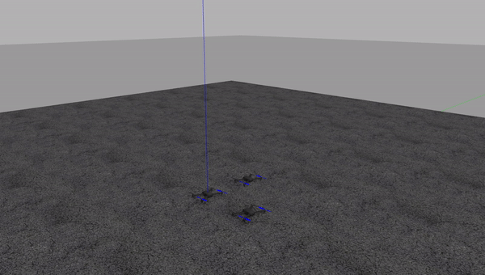

# mavros_swarm
[](https://travis-ci.org/Jaeyoung-Lim/mavros_swarm)

MAVROS based fleet trajectory control for swarming.




## Installing
The package can be built by the following
```
catkin build formation_control
```


## Running the code
A example can be run by the following.
```
roslaunch formation_control sitl_multiuav_swarm.launch
```
This automatically enables offboard mode and arms the vehicle. The three vehicles will hover in the predefined position according to the fomraiton definition

## Contact
Jaeyoung Lim jalim@student.ethz.ch